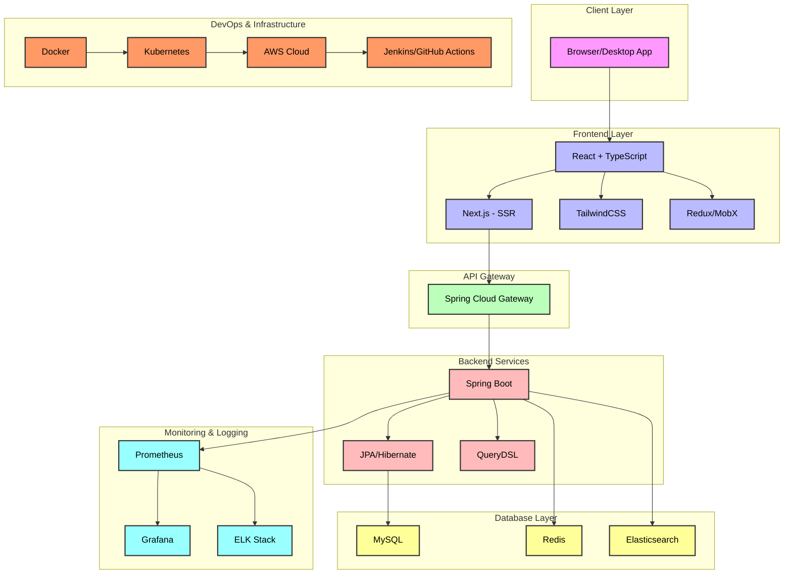
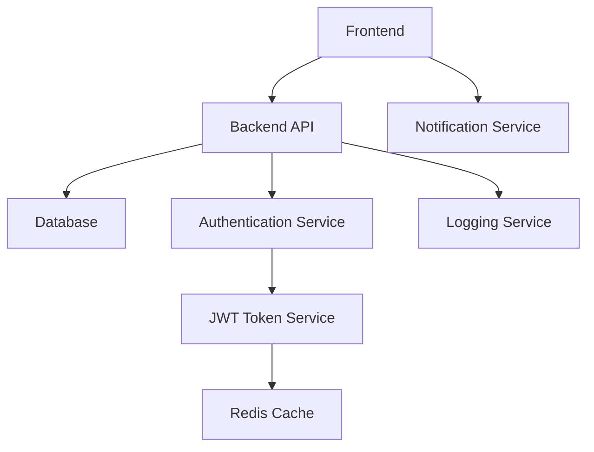

# MVP 개발 로드맵

### 1. **개발 방법론 및 접근 방식**

- **애자일 방법론**을 적용하여 단계별로 개발하고, 주기적으로 피드백을 반영하여 개발 진행.
- **스프린트 주기**는 1주 단위로 설정하고, 각 스프린트에서 중요한 기능을 완성한 뒤 테스트 및 리팩토링.
- 초기 MVP에서 제공할 핵심 기능을 우선 구현하고, 후속 단계에서 점진적으로 기능을 확장하는 방식을 취함.

### 2. **MVP 개발 계획**

- 기능 우선순위 정리:
  - 로그인, 회원 관리, 마크다운 기반 블로그 작성 및 편집 기능
  - 블로그 카테고리, 태그 시스템, 코드 하이라이팅
  - 깃허브 연동 및 자동 저장, 버전 관리

- 프론트엔드:
  - **React + TypeScript**: UI 컴포넌트 기반 개발로 유지보수성 높이기
  - **TailwindCSS**: 빠른 스타일링과 반응형 웹 디자인
  - **Next.js**: SEO 최적화 및 서버 사이드 렌더링(SSR)

- 백엔드:
  - **Spring Boot + JPA/Hibernate**: RESTful API를 제공하고, 데이터베이스 모델을 효율적으로 관리
  - **QueryDSL**: 복잡한 쿼리를 안전하게 처리

- 데이터베이스:
  - **MySQL**: 관계형 데이터 저장
  - **Redis**: 세션 관리 및 캐싱 시스템

- 인프라:
  - **Docker + Kubernetes**: 컨테이너화하여 배포와 확장성 확보
  - **AWS**: EC2, S3, CloudFront 등을 활용하여 클라우드 기반 서비스 제공

- **CI/CD**: Jenkins을 통해 코드 푸시 후 자동화된 빌드, 배포 프로세스 구축

### 3. **기술 스택 다이어그램**



### 4. **유스케이스 및 사용자 흐름** (구체화 필요)

#### 예시: 회원가입 유스케이스

1. **회원 가입**:
   - 사용자: "회원 가입" 버튼 클릭
   - 시스템:
     1. 사용자가 이메일, 비밀번호 입력 (프론트엔드 폼)
     2. 서버로 데이터 전송 (백엔드 API)
     3. 시스템은 이메일 인증을 위한 코드 전송
     4. 사용자는 이메일로 받은 인증 코드를 입력
     5. 인증 성공 후, 데이터베이스에 사용자 정보 저장
     6. 로그인 페이지로 리디렉션

   **시나리오 흐름 다이어그램**:

   ```mermaid
   sequenceDiagram
       participant User
       participant Frontend
       participant Backend
       participant DB
   
       User->>Frontend: Clicks "Sign Up"
       Frontend->>Backend: Send email & password
       Backend->>Frontend: Send verification code
       User->>Frontend: Inputs verification code
       Frontend->>Backend: Send verification code
       Backend->>DB: Store user info
       Backend->>Frontend: Redirect to login page
   ```

### 5. **클래스/인터페이스 명세서** (구체화 필요)

#### 예시: `User` 클래스

```text
클래스명: User

역할: 사용자 정보를 관리하고, 회원 가입 및 로그인 기능을 제공하는 클래스.

속성:
- id: 사용자 ID (Long)
- username: 사용자 이름 (String)
- email: 사용자 이메일 (String)
- passwordHash: 비밀번호 해시값 (String)
- roles: 사용자 역할 (List<Role>)

메서드:
- register(username: String, email: String, password: String): User
  설명: 사용자를 등록하고, 비밀번호를 해싱하여 데이터베이스에 저장

- authenticate(username: String, password: String): boolean
  설명: 사용자가 입력한 정보로 로그인 인증을 진행

- updateProfile(email: String): void
  설명: 사용자의 이메일을 업데이트

- changePassword(oldPassword: String, newPassword: String): boolean
  설명: 사용자의 비밀번호 변경
```

### 6. **모듈 및 인터페이스 명세서** (구체화 필요)

#### 예시: `Authentication` 모듈

```text
모듈명: Authentication

역할: 사용자 로그인 및 회원가입 관련 기능을 담당하는 모듈

API:
- POST /auth/register
  설명: 새 사용자를 등록하는 API
  입력:
    - username: String
    - email: String
    - password: String
  출력:
    - status: String
    - message: String
  예외:
    - DuplicateUserException: 이미 존재하는 사용자 이름이나 이메일

- POST /auth/login
  설명: 사용자가 로그인할 때 인증을 처리하는 API
  입력:
    - username: String
    - password: String
  출력:
    - accessToken: String
    - refreshToken: String
  예외:
    - AuthenticationFailedException: 잘못된 사용자명이나 비밀번호
```

### 7. **테스트 계획** (구체화 필요)

#### 예시: 단위 테스트

```text
테스트 항목:
- UserService의 register() 메서드
- 사용자 입력값이 유효한지 확인
- 이미 존재하는 이메일에 대해 DuplicateUserException을 던지는지 확인

사용 도구:
- JUnit 5: Java 기반 단위 테스트
- Mockito: 의존성 주입을 위한 목 객체(Mock Object) 사용

테스트 케이스:
1. 이메일, 사용자 이름, 비밀번호가 정상적으로 등록되는지 확인
2. 이메일이 중복된 경우 DuplicateUserException 예외 발생하는지 확인
3. 비밀번호가 8자 이상일 때만 성공적으로 등록되는지 확인
```

### 다이어그램

#### 예시: 컴포넌트 다이어그램



### 종합적으로 정리해 보면:

- **유스케이스 및 사용자 흐름**: 시스템을 사용하는 시나리오를 통해 구체적인 기능을 설계.
- **도메인/모델 명세서**: 도메인 모델에 대하여 명확히 정의.
- **클래스/인터페이스 명세서**: 도메인 객체의 역할과 책임을 명확히 정의.
- **모듈 및 인터페이스 명세서**: 각 기능 모듈에 대한 정의 및 API 규격 문서화.
- **테스트 계획**: 각 기능에 대한 테스트 범위와 도구, 테스트 케이스 정의.
- **다이어그램**: 시스템 및 기능 흐름을 시각적으로 표현.
