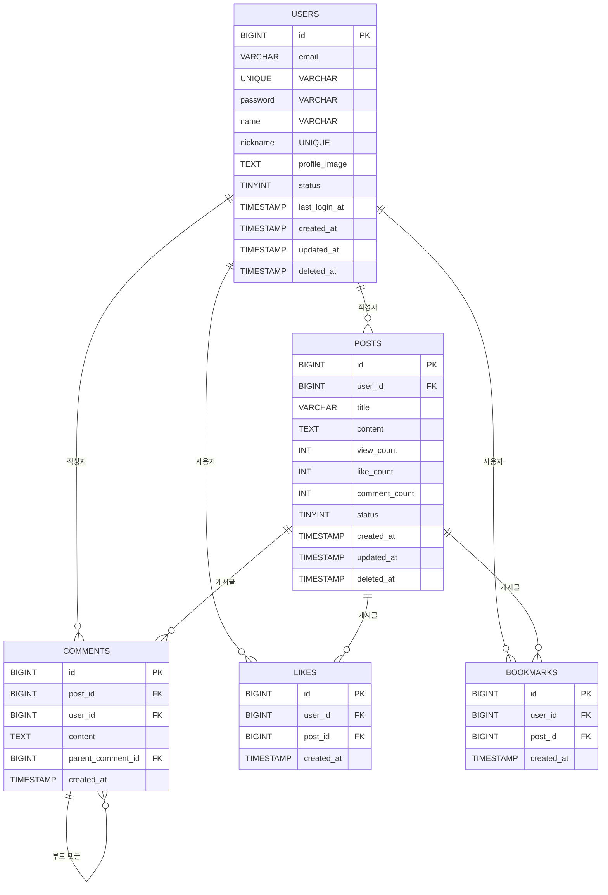

# **기능 세부 정의서**

## **1 기능 명세서**

### **1.1 로그인/회원가입 화면**

#### **회원가입**
- 필수 입력 정보
  - 이메일: 유효한 이메일 형식
  - 비밀번호: 8자 이상, 특수문자/숫자/영문 조합
  - 이름: 2-20자 이내
  - 이용약관 동의
- 이메일 인증 프로세스
  - 인증 메일 유효시간: 30분
  - 재발송 제한: 1분 간격, 일 5회 제한
- OAuth 소셜 로그인
  - Google OAuth 2.0
  - Kakao OAuth 2.0
  - Apple OAuth 2.0
  - 필수 권한: 이메일, 프로필 정보

#### **로그인**
- 로그인 방식
  - 이메일/비밀번호 로그인
  - 소셜 계정 로그인
  - "로그인 상태 유지" 옵션 (쿠키 유효기간 30일)
- 보안 정책
  - 로그인 실패 5회 시 계정 잠금
  - 계정 잠금 해제: 이메일 인증 또는 30분 후 자동 해제
  - JWT 토큰 기반 인증 (유효기간 2시간)
  - Refresh 토큰 (유효기간 14일)

### **1.2 대시보드 화면**

- 데이터 표시
  - 최근 작성 게시글 (최대 5개)
  - 읽지 않은 알림 (최대 10개)
  - 북마크한 게시글 (최대 5개)
- 알림 기능
  - 새 댓글 알림
  - 좋아요 알림
  - 멘션 알림
  - 알림 저장 기간: 30일
- 활동 로그
  - 최근 30일간의 활동 통계
  - 작성 게시글/댓글 수
  - 받은 좋아요 수

### **1.3 게시판 기능**

#### **게시글 관리**
- 작성 기능
  - 제목: 2-100자
  - 본문: 최대 50,000자
  - 이미지 첨부: 최대 10개, 각 5MB 이하
  - 임시저장: 자동 1분 주기, 수동 저장
- 수정/삭제
  - 작성자 본인만 가능
  - 관리자 삭제 권한
  - 수정 이력 관리
- 조회
  - 페이지당 20개 게시글
  - 정렬: 최신순/인기순/조회순
  - 필터: 카테고리, 태그, 기간

#### **댓글 시스템**
- 기본 기능
  - 댓글 작성: 최대 1,000자
  - 대댓글: 2depth까지 허용
  - 멘션 기능: @사용자명
- 관리 기능
  - 작성자/관리자 삭제 권한
  - 신고 기능: 5회 이상 시 자동 숨김

#### **상호작용 기능**
- 좋아요
  - 게시글/댓글 별도 집계
  - 취소 가능
- 북마크
  - 개인별 최대 100개
  - 카테고리 분류 가능

### **1.4 사용자 프로필 관리**

- 기본 정보
  - 프로필 이미지: 5MB 이하, jpg/png
  - 소개글: 최대 200자
  - 닉네임 변경: 30일에 1회 제한
- 보안 설정
  - 비밀번호 변경
  - 로그인 기록 조회
  - 접속 기기 관리
- 알림 설정
  - 이메일 수신 설정
  - 푸시 알림 설정
  - 마케팅 정보 수신 동의

---

## **2 데이터 모델 설계**



### **1.1 사용자 테이블 (`users`)**

| 필드명        | 타입         | 제약조건            | 설명                           |
| ------------- | ------------ | ------------------- | ------------------------------ |
| id            | BIGINT       | PK, AUTO_INCREMENT  | 사용자 고유 ID                 |
| email         | VARCHAR(255) | UNIQUE, NOT NULL    | 사용자 이메일                  |
| password      | VARCHAR(255) | NOT NULL            | 해싱된 비밀번호                |
| name          | VARCHAR(100) | NOT NULL            | 사용자 이름                    |
| nickname      | VARCHAR(50)  | UNIQUE              | 별명                           |
| profile_image | TEXT         | NULL                | 프로필 사진 URL                |
| status        | TINYINT      | NOT NULL, DEFAULT 1 | 계정 상태 (1: 활성, 0: 비활성) |
| last_login_at | TIMESTAMP    | NULL                | 마지막 로그인 시간             |
| created_at    | TIMESTAMP    | NOT NULL            | 계정 생성 일시                 |
| updated_at    | TIMESTAMP    | NOT NULL            | 마지막 수정 일시               |
| deleted_at    | TIMESTAMP    | NULL                | 계정 삭제 일시                 |

**인덱스**:

- idx_email (email)
- idx_nickname (nickname)
- idx_status (status)

------

### **1.2 게시글 테이블 (`posts`)**

| 필드명        | 타입         | 제약조건            | 설명                          |
| ------------- | ------------ | ------------------- | ----------------------------- |
| id            | BIGINT       | PK, AUTO_INCREMENT  | 게시글 고유 ID                |
| user_id       | BIGINT       | FK, NOT NULL        | 작성자 ID (users 테이블 참조) |
| title         | VARCHAR(255) | NOT NULL            | 게시글 제목                   |
| content       | TEXT         | NOT NULL            | 게시글 내용                   |
| view_count    | INT          | NOT NULL, DEFAULT 0 | 조회수                        |
| like_count    | INT          | NOT NULL, DEFAULT 0 | 좋아요 수                     |
| comment_count | INT          | NOT NULL, DEFAULT 0 | 댓글 수                       |
| status        | TINYINT      | NOT NULL, DEFAULT 1 | 상태 (1: 공개, 0: 비공개)     |
| created_at    | TIMESTAMP    | NOT NULL            | 작성일                        |
| updated_at    | TIMESTAMP    | NOT NULL            | 수정일                        |
| deleted_at    | TIMESTAMP    | NULL                | 삭제일                        |

**인덱스**:

- idx_user_id (user_id)
- idx_created_at (created_at)
- idx_status (status)
- idx_popular (view_count, like_count)

------

### **1.3 댓글 테이블 (`comments`)**

| 필드명            | 타입      | 제약조건           | 설명                          |
| ----------------- | --------- | ------------------ | ----------------------------- |
| id                | BIGINT    | PK, AUTO_INCREMENT | 댓글 고유 ID                  |
| post_id           | BIGINT    | FK, NOT NULL       | 게시글 ID (posts 테이블 참조) |
| user_id           | BIGINT    | FK, NOT NULL       | 작성자 ID (users 테이블 참조) |
| content           | TEXT      | NOT NULL           | 댓글 내용                     |
| parent_comment_id | BIGINT    | NULL, FK           | 부모 댓글 ID (대댓글 기능)    |
| created_at        | TIMESTAMP | NOT NULL           | 작성일                        |

**인덱스**:

- idx_post_id (post_id)
- idx_user_id (user_id)
- idx_parent_comment_id (parent_comment_id)

------

### **1.4 좋아요 테이블 (`likes`)**

| 필드명     | 타입      | 제약조건           | 설명                          |
| ---------- | --------- | ------------------ | ----------------------------- |
| id         | BIGINT    | PK, AUTO_INCREMENT | 좋아요 고유 ID                |
| user_id    | BIGINT    | FK, NOT NULL       | 사용자 ID (users 테이블 참조) |
| post_id    | BIGINT    | FK, NOT NULL       | 게시글 ID (posts 테이블 참조) |
| created_at | TIMESTAMP | NOT NULL           | 좋아요한 시간                 |

**인덱스**:

- idx_user_id (user_id)
- idx_post_id (post_id)

------

### **1.5 북마크 테이블 (`bookmarks`)**

| 필드명     | 타입      | 제약조건           | 설명                          |
| ---------- | --------- | ------------------ | ----------------------------- |
| id         | BIGINT    | PK, AUTO_INCREMENT | 북마크 고유 ID                |
| user_id    | BIGINT    | FK, NOT NULL       | 사용자 ID (users 테이블 참조) |
| post_id    | BIGINT    | FK, NOT NULL       | 게시글 ID (posts 테이블 참조) |
| created_at | TIMESTAMP | NOT NULL           | 북마크한 시간                 |

**인덱스**:

- idx_user_id (user_id)
- idx_post_id (post_id)

---

## **3 API 엔드포인트 설계**

### **1.1 사용자 관련 API**

- **회원가입 (POST `/api/v1/auth/signup`)**

  **요청**:

  ```json
  {
    "email": "test@example.com",
    "password": "Password123!",
    "name": "홍길동",
    "nickname": "길동이",
    "marketing_agree": true
  }
  ```

  **응답 (200 OK)**:

  ```json
  {
    "status": "success",
    "data": {
      "user_id": 12345,
      "email": "test@example.com",
      "name": "홍길동"
    }
  }
  ```

  **에러 응답**:

  - 400 Bad Request: 유효하지 않은 입력값
  - 409 Conflict: 중복된 이메일/닉네임
  - 500 Internal Server Error: 서버 오류

- **로그인 (POST `/api/v1/auth/login`)**

  **요청**:

  ```json
  {
    "email": "test@example.com",
    "password": "Password123!"
  }
  ```

  **응답 (200 OK)**:

  ```json
  {
    "status": "success",
    "data": {
      "token": "abcdefg12345"
    }
  }
  ```

  **에러 응답**:

  - 400 Bad Request: 유효하지 않은 입력값
  - 401 Unauthorized: 잘못된 이메일 또는 비밀번호
  - 500 Internal Server Error: 서버 오류

------

### **1.2 게시글 관련 API**

- **게시글 목록 조회 (GET `/api/v1/posts`)**

  **응답 (200 OK)**:

  ```json
  {
    "status": "success",
    "data": [
      {
        "id": 1,
        "title": "첫 번째 글",
        "user_id": 2,
        "created_at": "2024-02-23T12:00:00Z"
      }
    ]
  }
  ```

  **에러 응답**:

  - 500 Internal Server Error: 서버 오류

- **게시글 작성 (POST `/api/v1/posts`)**

  **요청**:

  ```json
  {
    "title": "새 글",
    "content": "내용",
    "user_id": 2
  }
  ```

  **응답 (201 Created)**:

  ```json
  {
    "status": "success",
    "message": "게시글이 등록되었습니다."
  }
  ```

  **에러 응답**:

  - 400 Bad Request: 유효하지 않은 입력값
  - 401 Unauthorized: 인증되지 않은 사용자
  - 500 Internal Server Error: 서버 오류

- **특정 게시글 조회 (GET `/api/v1/posts/{post_id}`)**

  **응답 (200 OK)**:

  ```json
  {
    "status": "success",
    "data": {
      "id": 1,
      "title": "첫 번째 글",
      "content": "내용",
      "user_id": 2,
      "created_at": "2024-02-23T12:00:00Z"
    }
  }
  ```

  **에러 응답**:

  - 404 Not Found: 게시글을 찾을 수 없음
  - 500 Internal Server Error: 서버 오류

- **게시글 수정 (PUT `/api/v1/posts/{post_id}`)**

  **요청**:

  ```json
  {
    "title": "수정된 제목",
    "content": "수정된 내용"
  }
  ```

  **응답 (200 OK)**:

  ```json
  {
    "status": "success",
    "message": "게시글이 수정되었습니다."
  }
  ```

  **에러 응답**:

  - 400 Bad Request: 유효하지 않은 입력값
  - 404 Not Found: 게시글을 찾을 수 없음
  - 500 Internal Server Error: 서버 오류

- **게시글 삭제 (DELETE `/api/v1/posts/{post_id}`)**

  **응답 (200 OK)**:

  ```json
  {
    "status": "success",
    "message": "게시글이 삭제되었습니다."
  }
  ```

  **에러 응답**:

  - 404 Not Found: 게시글을 찾을 수 없음
  - 500 Internal Server Error: 서버 오류

------

### **1.3 댓글 관련 API**

- **댓글 작성 (POST `/api/v1/posts/{post_id}/comments`)**

  **요청**:

  ```json
  {
    "content": "댓글 내용",
    "user_id": 2
  }
  ```

  **응답 (201 Created)**:

  ```json
  {
    "status": "success",
    "message": "댓글이 등록되었습니다."
  }
  ```

  **에러 응답**:

  - 400 Bad Request: 유효하지 않은 입력값
  - 401 Unauthorized: 인증되지 않은 사용자
  - 404 Not Found: 게시글을 찾을 수 없음
  - 500 Internal Server Error: 서버 오류

- **게시글의 댓글 목록 조회 (GET `/api/v1/posts/{post_id}/comments`)**

  **응답 (200 OK)**:

  ```json
  {
    "status": "success",
    "data": [
      {
        "id": 1,
        "content": "댓글 내용",
        "user_id": 2,
        "created_at": "2024-02-23T12:30:00Z"
      }
    ]
  }
  ```

  **에러 응답**:

  - 404 Not Found: 게시글을 찾을 수 없음
  - 500 Internal Server Error: 서버 오류

- **댓글 삭제 (DELETE `/api/v1/comments/{comment_id}`)**

  **응답 (200 OK)**:

  ```json
  {
    "status": "success",
    "message": "댓글이 삭제되었습니다."
  }
  ```

  **에러 응답**:

  - 404 Not Found: 댓글을 찾을 수 없음
  - 500 Internal Server Error: 서버 오류

------

### **1.4 좋아요 및 북마크 API**

- **좋아요 추가 (POST `/api/v1/posts/{post_id}/like`)**

  **응답 (200 OK)**:

  ```json
  {
    "status": "success",
    "message": "좋아요가 추가되었습니다."
  }
  ```

  **에러 응답**:

  - 404 Not Found: 게시글을 찾을 수 없음
  - 500 Internal Server Error: 서버 오류

- **좋아요 제거 (DELETE `/api/v1/posts/{post_id}/like`)**

  **응답 (200 OK)**:

  ```json
  {
    "status": "success",
    "message": "좋아요가 취소되었습니다."
  }
  ```

  **에러 응답**:

  - 404 Not Found: 게시글을 찾을 수 없음
  - 500 Internal Server Error: 서버 오류

- **북마크 추가 (POST `/api/v1/posts/{post_id}/bookmark`)**

  **응답 (200 OK)**:

  ```json
  {
    "status": "success",
    "message": "북마크가 추가되었습니다."
  }
  ```

  **에러 응답**:

  - 404 Not Found: 게시글을 찾을 수 없음
  - 500 Internal Server Error: 서버 오류

- **북마크 제거 (DELETE `/api/v1/posts/{post_id}/bookmark`)**

  **응답 (200 OK)**:

  ```json
  {
    "status": "success",
    "message": "북마크가 삭제되었습니다."
  }
  ```

  **에러 응답**:

  - 404 Not Found: 게시글을 찾을 수 없음
  - 500 Internal Server Error: 서버 오류
  
---

## **4 성능 요구사항**

### **1.1 응답시간**

- **페이지 로딩**:
  - **정의**: 페이지의 전체 로딩 시간은 2초를 넘지 않도록 한다.<br>
              이는 서버에서 필요한 데이터를 반환한 후, 클라이언트가 이를 렌더링할 때까지의 시간을 포함한다.
  - **실행 방법**: 페이지 요청 시 백엔드 API의 응답 최적화 및 클라이언트에서의 렌더링 최적화를 통해 2초 이내에 로드될 수 있도록 한다.<br>
              이를 위해 **이미지 최적화** 및 **CSS/JS 압축**을 적용한다.
- **API 응답**:
  - **정의**: 모든 API 응답은 1초 이내에 완료되어야 한다.
  - **실행 방법**: 데이터베이스 쿼리 최적화, 서버 캐싱 사용 및 쿼리 인덱싱을 통해 API 응답 속도를 1초 이내로 유지한다.
- **이미지 로딩**:
  - **정의**: 모든 이미지 파일은 3초 이내에 완전히 로드되어야 한다.
  - **실행 방법**: 이미지는 **CDN(Content Delivery Network)**을 사용하여 배포하고, **이미지 압축** 및 **lazy loading** 기법을 통해 로딩 시간을 최적화한다.

### **1.2 동시접속**

- **일반 상황**:
  - **정의**: 서버는 1000명의 동시 접속을 처리할 수 있어야 한다.
  - **실행 방법**: 서버는 **로드밸런서**와 함께 클러스터링된 환경에서 운영되며, **데이터베이스 분산 처리** 및 **캐싱 레이어**를 사용하여 부하를 분산한다.
- **피크 타임**:
  - **정의**: 피크 타임 동안 3000명의 동시 접속을 처리할 수 있어야 한다.
  - **실행 방법**: **오토스케일링**을 설정하여 트래픽이 급증할 때 자동으로 서버 자원을 확장하고, **CDN**을 사용해 정적 리소스를 분산하여 처리 성능을 개선한다.
- **버퍼**:
  - **정의**: 서버는 최대 120%인 3600명의 동시 접속까지 안정적으로 처리할 수 있어야 한다.
  - **실행 방법**: 서버는 **수평 확장(horizontal scaling)**을 통해 부하를 분산시키며, **캐시 서버**(예: Redis)를 통해 데이터베이스 부하를 줄인다.

### **1.3 데이터 처리량**

- **초당 트랜잭션**:
  - **정의**: 시스템은 최대 초당 100개의 트랜잭션을 처리해야 한다.
  - **실행 방법**: **비동기 처리** 및 **배치 처리**를 통해 높은 TPS를 유지하며, **쿼리 최적화**와 **인덱스 튜닝**을 통해 DB 부하를 줄인다.
- **일일 데이터 처리량**:
  - **정의**: 시스템은 하루에 최대 1GB의 데이터를 처리할 수 있어야 한다.
  - **실행 방법**: 데이터 압축 기법을 사용하고, **데이터 정규화**를 통해 데이터 저장소를 효율적으로 관리한다.
- **백업 주기**:
  - **정의**: 시스템은 매일 1회 데이터를 백업해야 한다.
  - **실행 방법**: 자동화된 백업 스크립트를 설정하고, 백업 파일은 **암호화**하여 안전한 장소에 저장한다.

------

## **5 보안 요구사항**

### **1.1 인증/인가**

- **JWT 기반 인증**:
  - **정의**: 사용자는 로그인 시 **JWT**를 발급받고, 이를 통해 이후 요청을 인증한다.
  - **실행 방법**: 로그인 API에서 JWT를 발급하고, 모든 API 요청 시 헤더에 `Authorization: Bearer <JWT>`를 첨부하여 인증한다.<br>
             JWT의 만료 시간은 1시간으로 설정하며, 갱신 토큰을 통해 세션을 연장한다.
- **Role 기반 권한 관리**:
  - **정의**: 각 사용자는 특정 역할(Role)을 부여받고, 이에 맞는 권한만을 부여받는다.
  - **실행 방법**: 사용자 데이터베이스에 `role` 필드를 추가하고, API 엔드포인트마다 `role` 기반으로 접근 권한을 확인한다.
- **OAuth 2.0 표준 준수**:
  - **정의**: 외부 인증 서비스를 연동할 때, OAuth 2.0을 사용하여 사용자 인증을 처리한다.
  - **실행 방법**: **구글**, **페이스북** 등 외부 인증 시스템을 OAuth 2.0을 통해 연동하여, 사용자가 외부 계정으로 로그인할 수 있도록 한다.

### **1.2 데이터 보안**

- **모든 통신 HTTPS 적용**:
  - **정의**: 모든 클라이언트와 서버 간의 통신은 HTTPS를 통해 암호화되어야 한다.
  - **실행 방법**: 서버는 **SSL 인증서**를 사용하여 HTTPS를 적용하고, 모든 API와 리소스 요청은 HTTPS 프로토콜을 통해 처리된다.
- **개인정보 암호화 저장**:
  - **정의**: 사용자 개인정보(이메일, 비밀번호 등)는 암호화하여 저장한다.
  - **실행 방법**: **비밀번호**는 `bcrypt` 해시 알고리즘을 사용하여 저장하고, **개인정보**는 **AES-256** 암호화 기법을 사용하여 암호화하여 저장한다.
- **SQL Injection 방지**:
  - **정의**: SQL Injection 공격을 방지하기 위해 모든 DB 쿼리는 파라미터화된 쿼리 방식으로 작성해야 한다.
  - **실행 방법**: ORM(Object-Relational Mapping)을 사용하여 쿼리를 생성하고, 직접 SQL을 작성할 경우 반드시 파라미터화된 쿼리 방식을 사용한다.

### **1.3 보안 정책**

- **비밀번호 정책 준수**:
  - **정의**: 사용자 비밀번호는 최소 8자 이상, 대문자, 소문자, 숫자, 특수문자를 포함해야 한다.
  - **실행 방법**: 비밀번호 변경 시, 클라이언트에서 유효성 검사 및 서버에서 추가 검증을 실시하여 정책을 준수한다.
- **계정 잠금 정책**:
  - **정의**: 비밀번호를 여러 번 잘못 입력할 경우 계정을 잠금 처리한다.
  - **실행 방법**: 로그인 실패가 5회 이상 발생할 경우, 계정을 15분 동안 잠그고, 잠금 해제는 이메일 인증을 통해 진행된다.
- **로그인 시도 제한**:
  - **정의**: 동일 IP에서 로그인 시도 횟수를 제한하여 공격을 방지한다.
  - **실행 방법**: 1분당 로그인 시도를 10회로 제한하고, 이를 초과하면 IP를 차단한다.


### **1.4 로그 및 모니터링**

- **로그 기록 및 모니터링**:
  - **정의**: 시스템에서 발생하는 모든 중요한 이벤트(로그인 시도, 권한 변경, 데이터 접근 등)는 로그로 기록하고, 실시간 모니터링을 통해 의심스러운 활동을 탐지한다.
  - **실행 방법**: 로그 파일은 중앙 집중형 로깅 시스템(예: ELK 스택)을 통해 수집하고, 실시간 모니터링 시스템을 구축하여 비정상적인 활동을 감지하고 경고를 발생시킨다.

- **로그 인덱싱 및 보존**:
  - **정의**: 중요 로그는 인덱싱하여 검색 가능하게 하고, 일정 기간 동안 보존한다.
  - **실행 방법**: 로그는 1년 이상 보존하며, 보안 사고를 조사할 수 있도록 적절한 포맷으로 저장된다.

### **1.5 서비스 거부 공격(DoS/DDoS) 대응**

- **DDoS 공격 방어**:
  - **정의**: DDoS(분산 서비스 거부) 공격에 대비하여 트래픽을 분산시키고, 악의적인 요청을 차단한다.
  - **실행 방법**: 클라우드 서비스 제공업체(AWS, Azure, GCP 등)의 DDoS 보호 기능을 활성화하거나, **Cloudflare**와 같은 서비스를 사용해 트래픽을 필터링한다.

### **1.6 취약점 점검 및 패치 관리**

- **정기적인 보안 점검**:
  - **정의**: 시스템의 보안 취약점을 주기적으로 점검하고, 발견된 취약점에 대한 패치를 관리한다.
  - **실행 방법**: 월 1회 이상의 보안 점검을 진행하며, OWASP Top 10 취약점에 대한 점검과 대응을 포함한다.

- **소프트웨어 버전 관리 및 패치 적용**:
  - **정의**: 사용 중인 소프트웨어나 라이브러리는 최신 보안 패치가 적용된 버전으로 유지된다.
  - **실행 방법**: 의존성 관리 도구(예: `npm audit`, `pip audit`)를 사용하여 보안 취약점을 자동으로 점검하고, 새로운 패치가 있을 때 즉시 적용한다.

### **1.7 API 보안 강화**

- **API Rate Limiting**:
  - **정의**: API에 대한 과도한 요청을 방지하기 위해 일정 시간 내에 요청 횟수를 제한한다.
  - **실행 방법**: API 서버에 **Rate Limiting**을 설정하여 동일 IP나 사용자에 대해 일정 시간 동안 요청 횟수를 제한한다.

- **API Key 사용**:
  - **정의**: 외부 서비스나 사용자가 API를 호출할 때 **API Key**를 사용하여 인증한다.
  - **실행 방법**: API 요청 시 클라이언트가 제공하는 API Key를 검증하여 권한을 부여하며, 민감한 API 요청은 API Key를 통해만 접근할 수 있도록 한다.

------

## **6 테스트 시나리오**

### **1.1 단위 테스트**

- **정의**: 각 컴포넌트별 기능을 독립적으로 테스트하며, 주요 비즈니스 로직을 검증한다.
- **실행 방법**: **Jest** 또는 **JUnit**을 사용하여 각 API와 비즈니스 로직을 테스트하며, 코드 커버리지를 80% 이상 확보한다.

### **1.2 통합 테스트**

- **정의**: 시스템의 각 컴포넌트가 상호작용하는지 테스트한다.
- **실행 방법**: 각 API 엔드포인트에 대해 실제 데이터를 입력하고, 시스템 전체의 동작을 테스트한다. **Postman** 또는 **RestAssured**를 사용한다.

### **1.3 부하 테스트**

- **정의**: 시스템이 예상되는 최대 트래픽을 처리할 수 있는지 테스트한다.
- **실행 방법**: **JMeter** 또는 **Gatling**을 사용하여 동시 접속 수가 많을 때 시스템의 성능을 테스트한다.

------

## **7 배포 전략**

### **1.1 배포 환경**

- **정의**: 개발, 스테이징, 운영 환경을 구분하여 배포한다.

- **실행 방법**:
  - **개발 환경**: 코드 변경 후 개발 환경에서 테스트
  - **스테이징 환경**: 운영 환경과 유사한 환경에서 최종 검증
  - **운영 환경**: 실제 사용자가 접속하는 환경, CI/CD를 통해 자동 배포

### **1.2 배포 프로세스**

- **정의**: 새로운 기능 및 수정 사항을 운영 서버에 안전하게 배포한다.
- **실행 방법**: **Blue-Green 배포 전략**을 사용하여 새로운 버전의 애플리케이션을 배포할 때,<br>
                 이전 버전과 새로운 버전을 동시에 운영하여 문제 발생 시 신속히 롤백할 수 있도록 한다.

### **1.3 모니터링**

- **정의**: 시스템의 상태와 사용자 행동을 실시간으로 모니터링한다.

- **실행 방법**:
  - **서버 리소스 모니터링**: **Prometheus**와 **Grafana**를 사용하여 서버의 CPU, 메모리, 디스크 사용량을 모니터링.
  - **에러 로깅 및 알림**: **Sentry** 또는 **ELK Stack**을 사용하여 에러를 추적하고, 알림을 통해 문제를 신속하게 대응한다.
  - **사용자 행동 분석**: **Google Analytics** 또는 **Hotjar**를 사용하여 사용자의 행동을 분석하고 개선점을 도출한다.
