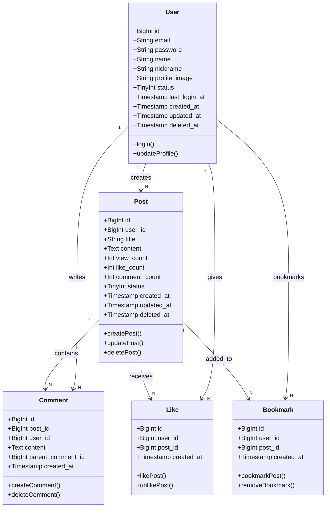

# 클래스 명세서 

### **1. User 클래스**

- **속성**:
  - `id`: 사용자 고유 ID
  - `email`: 사용자 이메일 (유니크)
  - `password`: 해싱된 비밀번호
  - `name`: 사용자 이름
  - `nickname`: 사용자 별명 (유니크)
  - `profile_image`: 프로필 사진 URL
  - `status`: 계정 상태 (활성, 비활성)
  - `last_login_at`: 마지막 로그인 시간
  - `created_at`: 계정 생성 일시
  - `updated_at`: 마지막 수정 일시
  - `deleted_at`: 계정 삭제 일시

- **메소드**:
  - `login()`: 사용자가 로그인할 때 호출되는 메소드. 이메일과 비밀번호를 검증하여 JWT 토큰을 발급.
  - `updateProfile()`: 사용자가 프로필을 업데이트할 때 호출되는 메소드. (이메일, 이름, 별명, 프로필 사진 등 수정)

### **2. Post 클래스**

- **속성**:
  - `id`: 게시글 고유 ID
  - `user_id`: 게시글 작성자 ID (User 테이블과의 관계)
  - `title`: 게시글 제목
  - `content`: 게시글 내용
  - `view_count`: 게시글 조회수
  - `like_count`: 게시글 좋아요 수
  - `comment_count`: 게시글 댓글 수
  - `status`: 게시글 상태 (공개, 비공개)
  - `created_at`: 게시글 작성 일시
  - `updated_at`: 게시글 수정 일시
  - `deleted_at`: 게시글 삭제 일시
- **메소드**:
  - `createPost()`: 새 게시글을 생성하는 메소드.
  - `updatePost()`: 게시글을 수정하는 메소드.
  - `deletePost()`: 게시글을 삭제하는 메소드.

### **3. Comment 클래스**

- **속성**:
  - `id`: 댓글 고유 ID
  - `post_id`: 게시글 ID (Post 테이블과의 관계)
  - `user_id`: 댓글 작성자 ID (User 테이블과의 관계)
  - `content`: 댓글 내용
  - `parent_comment_id`: 부모 댓글 ID (대댓글을 위한 필드)
  - `created_at`: 댓글 작성 일시

- **메소드**:
  - `createComment()`: 댓글을 생성하는 메소드.
  - `deleteComment()`: 댓글을 삭제하는 메소드.

### **4. Like 클래스**

- **속성**:
  - `id`: 좋아요 고유 ID
  - `user_id`: 사용자 ID (User 테이블과의 관계)
  - `post_id`: 게시글 ID (Post 테이블과의 관계)
  - `created_at`: 좋아요 시간

- **메소드**:
  - `likePost()`: 게시글에 좋아요를 추가하는 메소드.
  - `unlikePost()`: 게시글에서 좋아요를 취소하는 메소드.

### **5. Bookmark 클래스**

- **속성**:
  - `id`: 북마크 고유 ID
  - `user_id`: 사용자 ID (User 테이블과의 관계)
  - `post_id`: 게시글 ID (Post 테이블과의 관계)
  - `created_at`: 북마크한 시간

- **메소드**:
  - `bookmarkPost()`: 게시글을 북마크하는 메소드.
  - `removeBookmark()`: 게시글에서 북마크를 제거하는 메소드.

------

### **클래스 다이어그램**

