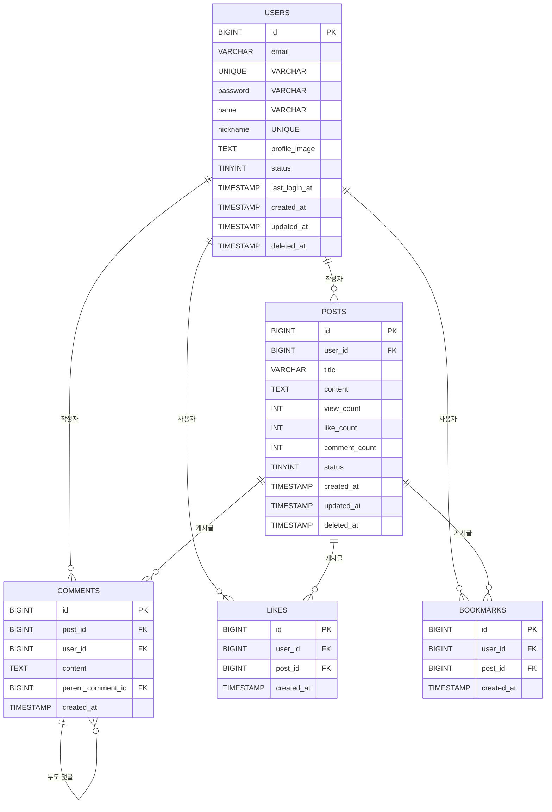

# 블로그 플랫폼 웹 애플리케이션 발표 자료

------

## **1. 기본 개요**

### **프로젝트명**

- 블로그 플랫폼 웹 애플리케이션 (미정)

### **목적**

1. 개인이 편리하게 사용할 수 있는 블로그 플랫폼 개발
2. 포트폴리오로 활용 가능하도록 개발
3. 실제 서비스 운영을 연습하고 문제점을 파악하기 위함
4. 현대적인 기술 스택을 활용한 확장 가능한 시스템 구축
5. 실제 사용자 피드백을 통한 지속적인 개선

### **주요 기능**

- 블로그 및 문서 편집 기능 제공
- 마크다운 기반의 작성 및 협업 기능 지원
- 깃허브 연동 및 커밋 기능 제공
- 실시간 협업 및 버전 관리 시스템
- SEO 최적화 및 소셜 미디어 공유 기능

### **대상 사용자**

- 개인 (자기 자신)
- 개발자 및 마크다운 기반 블로그 작성자
- 기술 문서 작성이 필요한 IT 종사자
- 협업이 필요한 소규모 팀

------

## **2. 기능 요구사항**

### **2.1 필수 기능 (MVP)**

1. **회원 관리**
   - 회원 가입, 로그인, 비밀번호 찾기
   - OAuth 소셜 로그인 (Google, GitHub, Kakao)
   - 이메일 인증 및 2단계 인증
   - 프로필 관리 및 커스터마이징
   - 활동 이력 및 통계 대시보드
2. **블로그 기능**
   - 개인 블로그 페이지 제공
   - 블로그 주제 설정
   - 블로그 안에 카테고리 설정 및 하위 폴더 및 문서 삽입 (윈도우 탐색기처럼)
   - 마크다운 기반의 문서 작성, 편집, 삭제
   - 미리보기 모드 제공
   - UI 커스텀 편집 기능
   - 코드 하이라이팅 지원
   - 이미지 및 파일 첨부 기능
   - 자동 저장 및 버전 관리
   - 태그 시스템 및 시리즈 기능
3. **검색 및 소셜 기능**
   - 블로그 주제 기반 검색 제공 및 추천
   - 문서 및 회원 검색
   - 댓글 기능 제공
   - 다른 사용자의 게시글 검색 및 확인 (조회수, 좋아요 기능)
   - 실시간 인기 게시글 표시
   - 소셜 미디어 공유 버튼
   - 구독 및 팔로우 시스템
   - 알림 센터 (댓글, 좋아요, 팔로우 등)
4. **설정 기능**
   - 사용자 환경설정
   - 블로그 도메인 설정
   - 개인정보 보호 설정
   - 알림 설정
   - 접근성 설정
   - 백업 및 복원 기능

------

## **3. 기술 스택**

### **프론트엔드**

| 기술                         | 선택 이유                                       |
| :--------------------------- | :---------------------------------------------- |
| **React (TypeScript)**       | 유지보수성과 타입 안정성을 위해 TypeScript 사용 |
| **React CodeMirror**         | 마크다운 에디터                                 |
| **React Markdown**           | 마크다운 렌더링 및 변환                         |
| **Remark-gfm**               | 마크다운 확장 (테이블, 체크박스 등)             |
| **React Syntax Highlighter** | 코드 블록 하이라이팅 지원                       |
| **Tailwind CSS**             | 빠른 스타일링 및 유지보수                       |
| **Zustand**                  | 간단하고 가벼운 상태 관리                       |
| **React Query**              | 비동기 데이터 패칭 및 캐싱 최적화               |

### **백엔드**

| 기술                          | 선택 이유                                    |
| :---------------------------- | :------------------------------------------- |
| **Spring Boot**               | 빠른 개발과 유지보수성, 기업용 서비스에 적합 |
| **Spring Security**           | 인증 및 권한 관리                            |
| **Spring Data JPA**           | ORM 활용하여 데이터베이스 연동               |
| **QueryDSL**                  | 복잡한 쿼리 최적화 및 가독성 향상            |
| **Lombok**                    | 코드 간소화                                  |
| **MapStruct**                 | 객체 변환(DTO ↔ Entity)                      |
| **Spring WebFlux (Optional)** | 비동기 처리가 필요한 경우                    |

### **데이터베이스**

| 기술                          | 선택 이유                       |
| :---------------------------- | :------------------------------ |
| **MySQL (Master-Slave 구조)** | 데이터 정합성 유지, 확장성 고려 |
| **Redis**                     | 캐싱, 세션 저장 및 성능 최적화  |
| **Flyway**                    | 데이터베이스 마이그레이션 관리  |

### **배포 및 운영**

| 기술                     | 선택 이유                          |
| :----------------------- | :--------------------------------- |
| **Docker**               | 컨테이너화를 통한 환경 일관성 유지 |
| **Kubernetes**           | 확장성과 자동 배포 지원            |
| **AWS (EC2)**            | 클라우드 인프라 활용               |
| **Nginx**                | 리버스 프록시 및 로드 밸런싱       |
| **Prometheus + Grafana** | 모니터링 및 알림 시스템            |

------

## **4. ERD (Entity Relationship Diagram)**

------

## **5. API 엔드포인트 설계**

### **1.1 사용자 관련 API**

| **API**                                 | **요청**                                                     | **응답**                                                     |
| --------------------------------------- | ------------------------------------------------------------ | ------------------------------------------------------------ |
| **회원가입 (POST /api/v1/auth/signup)** | `json { "email": "test@example.com", "password": "Password123!", "name": "홍길동", "nickname": "길동이", "marketing_agree": true }` | `json { "status": "success", "data": { "user_id": 12345, "email": "test@example.com", "name": "홍길동" } }` |
| **로그인 (POST /api/v1/auth/login)**    | `json { "email": "test@example.com", "password": "Password123!" }` | `json { "status": "success", "data": { "token": "abcdefg12345" } }` |

### **1.2 게시글 관련 API**

| **API**                                            | **요청**                                                     | **응답**                                                     |
| -------------------------------------------------- | ------------------------------------------------------------ | ------------------------------------------------------------ |
| **게시글 목록 조회 (GET /api/v1/posts)**           | -                                                            | `json { "status": "success", "data": [ { "id": 1, "title": "첫 번째 글", "user_id": 2, "created_at": "2024-02-23T12:00:00Z" } ] }` |
| **게시글 작성 (POST /api/v1/posts)**               | `json { "title": "새 글", "content": "내용", "user_id": 2 }` | `json { "status": "success", "message": "게시글이 등록되었습니다." }` |
| **특정 게시글 조회 (GET /api/v1/posts/{post_id})** | -                                                            | `json { "status": "success", "data": { "id": 1, "title": "첫 번째 글", "content": "내용", "user_id": 2, "created_at": "2024-02-23T12:00:00Z" } }` |
| **게시글 수정 (PUT /api/v1/posts/{post_id})**      | `json { "title": "수정된 제목", "content": "수정된 내용" }`  | `json { "status": "success", "message": "게시글이 수정되었습니다." }` |
| **게시글 삭제 (DELETE /api/v1/posts/{post_id})**   | -                                                            | `json { "status": "success", "message": "게시글이 삭제되었습니다." }` |

### **1.3 댓글 관련 API**

| **API**                                                      | **요청**                                        | **응답**                                                     |
| ------------------------------------------------------------ | ----------------------------------------------- | ------------------------------------------------------------ |
| **댓글 작성 (POST /api/v1/posts/{post_id}/comments)**        | `json { "content": "댓글 내용", "user_id": 2 }` | `json { "status": "success", "message": "댓글이 등록되었습니다." }` |
| **게시글의 댓글 목록 조회 (GET /api/v1/posts/{post_id}/comments)** | -                                               | `json { "status": "success", "data": [ { "id": 1, "content": "댓글 내용", "user_id": 2, "created_at": "2024-02-23T12:30:00Z" } ] }` |
| **댓글 삭제 (DELETE /api/v1/comments/{comment_id})**         | -                                               | `json { "status": "success", "message": "댓글이 삭제되었습니다." }` |

### **1.4 좋아요 및 북마크 API**

| **API**                                                   | **요청** | **응답**                                                     |
| --------------------------------------------------------- | -------- | ------------------------------------------------------------ |
| **좋아요 추가 (POST /api/v1/posts/{post_id}/like)**       | -        | `json { "status": "success", "message": "좋아요가 추가되었습니다." }` |
| **좋아요 제거 (DELETE /api/v1/posts/{post_id}/like)**     | -        | `json { "status": "success", "message": "좋아요가 취소되었습니다." }` |
| **북마크 추가 (POST /api/v1/posts/{post_id}/bookmark)**   | -        | `json { "status": "success", "message": "북마크가 추가되었습니다." }` |
| **북마크 제거 (DELETE /api/v1/posts/{post_id}/bookmark)** | -        | `json { "status": "success", "message": "북마크가 삭제되었습니다." }` |
## **6. 결론**

이 프로젝트는 개인 및 소규모 팀을 위한 블로그 플랫폼으로, 마크다운 기반의 문서 작성 및 협업 기능을 제공합니다. 현대적인 기술 스택을 활용하여 확장 가능하고 유지보수성이 높은 시스템을 구축하며, 사용자 피드백을 통해 지속적으로 개선할 예정입니다.
